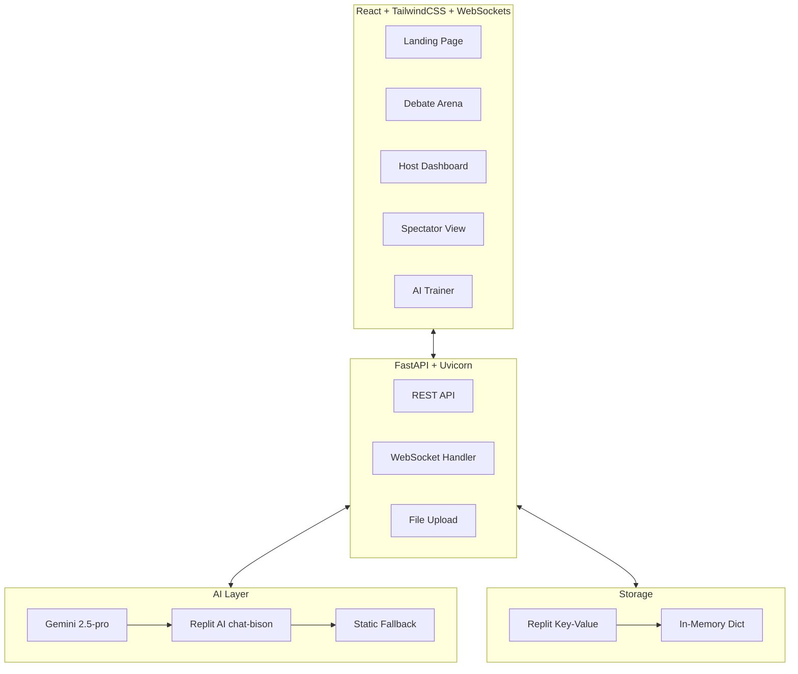

# Oratio — AI-Powered Debate Arena

**Real-time voice/text debates judged by AI. Built for Replit Vibeathon.**

<p align="center">
  
  
  
  
  
</p>

---

## What It Does

Oratio transforms debates into AI-enhanced experiences. Hosts create rooms, speakers argue via voice or text, a live AI judge scores each round using the LCR model (Logic, Credibility, Rhetoric), spectators watch and reward participants, and post-debate the AI generates personalized training plans.

---

## Architecture



---

## The LCR Judging Model

Each participant is scored on three axes:

| Criterion | Weight | What It Measures |
|-----------|--------|------------------|
| **Logic (L)** | 40% | Coherence, reasoning structure, argument flow |
| **Credibility (C)** | 35% | Fact accuracy, evidence use, consistency |
| **Rhetoric (R)** | 25% | Tone, persuasion, clarity, delivery |

**Verdict format:** Winner, LCR scores per participant, strengths/weaknesses, fact-checking results, summary.

---

## Features

| Feature | Detail |
|---------|--------|
| **Voice + Text Input** | Speak via Web Speech API or type. Live WebSocket broadcast to room |
| **AI Judge** | LCR evaluation with fact-checking (Serper API). Multi-tier fallback |
| **Spectator Mode** | View-only join, emoji rewards (👏🔥❤️💡), audience sentiment analytics |
| **AI Trainer** | Post-debate personalized feedback, XP system, badges, leaderboards |
| **Multi-Tier Fallback** | Gemini → Replit AI → Static. Replit DB → In-Memory. Graceful degradation |

---

## Tech Stack

| Layer | Technology |
|-------|-----------|
| **Frontend** | React 18, TailwindCSS, Framer Motion, Web Speech API |
| **Backend** | FastAPI 0.95+, Pydantic 2.0+, Uvicorn, ORJSONResponse (3-5x faster JSON) |
| **AI** | Google Gemini (gemini-2.5-pro) → Replit AI (chat-bison) → Static fallback |
| **Speech** | Browser SpeechRecognition API |
| **Fact Checking** | Serper API (free tier) |
| **Database** | Replit DB (production) / In-Memory Dict (local) |
| **Auth** | Replit Auth / Simple JWT |
| **Deployment** | Replit, Docker + Docker Compose |

---

## API Surface

| Module | Endpoints | Purpose |
|--------|-----------|---------|
| Auth | 5 | Register, login, profile, logout |
| Rooms | 5 | Create, get, update, delete, list |
| Participants | 4 | Join, leave, ready status |
| Spectators | 4 | Join, reward, stats, leave |
| Debate | 5 | Submit turn, upload audio, transcript, end, status |
| AI | 5 | Analyze turn, fact-check, final score, summary, report |
| Trainer | 6 | Analyze performance, recommendations, challenges, progress, badges |
| Uploads | 5 | PDF, audio, URL, list, delete |
| Utilities | 4 | Health, config, feedback, leaderboard |

**WebSocket endpoints:** `ws://host/ws/debate/{room_id}`, `ws://host/ws/spectator/{room_id}`, `ws://host/ws/trainer/{user_id}`

---

## Quick Start

```bash
# Clone
git clone https://github.com/Muneer320/Oratio.git
cd Oratio

# Docker (recommended)
docker compose up --build

# Or manual dev
cd backend && pip install -r requirements.txt
uvicorn app.main:app --reload --port 8000

cd frontend && npm install && npm run dev
```

The app works without any API keys — AI falls back to static responses automatically.

---

## License

MIT © Muneer Alam